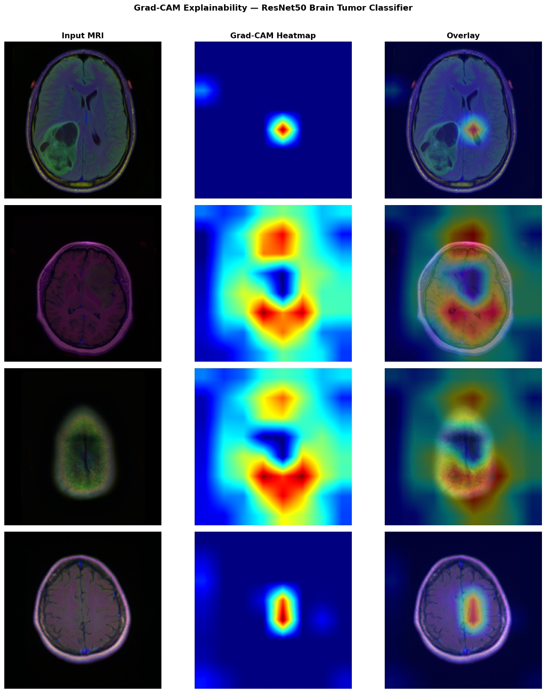

# Brain MRI Tumour Detection and Segmentation: An End-to-End MLOps Pipeline

[](https://www.python.org/)
[](https://www.tensorflow.org/)
[](https://mlflow.org/)
[](https://fastapi.tiangolo.com/)
[](https://www.docker.com/)
[](LICENSE)

---

## Abstract

This repository presents a production-grade, end-to-end machine learning pipeline for automated brain tumour detection and segmentation from FLAIR MRI scans. The system integrates a two-stage deep learning architecture, a ResNet50 binary classifier cascaded with a ResUNet segmentation model, trained on the Lower-Grade Glioma (LGG) MRI dataset. The pipeline is designed to address core challenges in clinical medical image analysis: class imbalance, boundary delineation accuracy, and model interpretability. The work is further positioned within an MLOps framework, incorporating experiment tracking, model registry, REST API serving, containerisation, and CI/CD automation, demonstrating a rigorous pathway from research to deployment.

---

## Model Performance


| Model | Metric | Score |
|---|---|---|
| ResNet50 Classifier | Accuracy | ~80% |
| ResNet50 Classifier | AUC | 0.844 |
| ResUNet Segmentor | Dice Score | 0.9266 |
| ResUNet Segmentor | IoU Score | 0.8794 |
| ResUNet Segmentor | Tversky Score | 0.9633 |

---

## Segmentation Results

The figure below presents qualitative segmentation predictions on four representative test samples, juxtaposing ground truth binary masks with ResUNet predictions. The model demonstrates consistent spatial accuracy across diverse tumour morphologies, including small focal lesions (Dice = 0.850), large irregular masses (Dice = 0.962), multi-region lesions (Dice = 0.941), and complex fragmented tumour distributions (Dice = 0.933).


---

## Explainability: Grad-CAM Analysis

To address the clinical imperative for interpretable AI, Gradient-weighted Class Activation Mapping (Grad-CAM) was applied to the ResNet50 classifier. The heatmaps localise discriminative regions within the final convolutional layer (`conv5_block3_out`), providing spatial attribution of the model's classification decision. Activation patterns are consistently concentrated in anatomically plausible regions corresponding to documented tumour locations in the LGG cohort, supporting the trustworthiness of the model's predictions for clinical decision support.



---

## Background and Motivation

Gliomas are the most prevalent primary brain tumours in adults, with lower-grade gliomas (WHO Grades II and III) presenting a significant clinical management challenge due to their diffuse infiltrative growth pattern. Accurate segmentation of tumour extent from MRI is critical for surgical planning, radiotherapy target delineation, and longitudinal treatment monitoring. Manual delineation by neuroradiologists is time-intensive and subject to inter-observer variability. This work investigates the capacity of deep residual architectures to automate this process with clinically relevant accuracy and interpretability.

---

## Dataset

The LGG MRI Segmentation dataset (Kaggle, Buda et al., 2019) comprises pre-operative MRI examinations from 110 patients diagnosed with lower-grade glioma across three institutions participating in The Cancer Genome Atlas (TCGA). Each examination includes a FLAIR sequence and corresponding binary tumour mask.

- **Total image-mask pairs:** 3,929
- **Tumour-positive slices:** 1,373
- **Image resolution:** 256 x 256 pixels (resized)
- **Modality:** FLAIR MRI

---

## Architecture

### Stage 1: ResNet50 Binary Classifier

A ResNet50 backbone pre-trained on ImageNet is fine-tuned for binary tumour classification (tumour-present vs. tumour-absent). The final 50 layers are unfrozen to facilitate domain adaptation to MRI-specific feature representations. A custom classification head comprising three Dense(256) layers with Dropout(0.3) regularisation and a softmax output is appended.

### Stage 2: ResUNet Segmentor

The segmentation model adopts a ResUNet architecture, combining the encoder-decoder structure of U-Net with residual connections. Residual blocks at each encoder stage mitigate the vanishing gradient problem in deep networks, while multi-scale skip connections preserve fine-grained spatial detail critical for accurate boundary delineation. The decoder employs transposed convolutions for learnable upsampling.

### Loss Function: Focal Tversky Loss

To address the severe foreground/background class imbalance inherent in brain lesion segmentation, a Focal Tversky Loss is employed:

```
FTL = (1 - TI)^gamma
TI  = TP / (TP + alpha * FN + beta * FP)
```

Parameters: alpha = 0.7, beta = 0.3, gamma = 0.75. The elevated alpha coefficient penalises false negatives more heavily than false positives, which is clinically appropriate since missed tumour tissue carries greater consequence than over-segmentation.

---

## MLOps Pipeline Architecture

```
Raw LGG MRI Data
       |
       v
Data Preprocessing (CLAHE, Normalisation, Augmentation)
       |
       v
Stage 1: ResNet50 Classifier  ------>  MLflow Experiment Tracking
       |                                      |
       v                                      v
Stage 2: ResUNet Segmentor    ------>  Model Registry (Staging / Production)
       |
       v
Evaluation (Dice, IoU, AUC, Grad-CAM)
       |
       v
FastAPI REST Inference Service + Gradio Demo UI
       |
       v
Docker Compose Containerisation
       |
       v
GitHub Actions CI/CD (Lint, Test, Build, Deploy)
```

---

## Repository Structure

```
mri-brain-tumor-mlops/
├── MRI_BrainTumor_MLOps_Colab.ipynb
├── configs/
│   └── config.yaml
├── src/
│   ├── data/
│   │   ├── dataset.py
│   │   └── preprocessing.py
│   ├── models/
│   │   ├── classifier.py
│   │   └── resunet.py
│   ├── training/
│   │   ├── train_classifier.py
│   │   └── train_segmentation.py
│   ├── evaluation/
│   │   ├── evaluate.py
│   │   └── gradcam.py
│   ├── serving/
│   │   ├── app.py
│   │   └── gradio_app.py
│   └── monitoring/
│       └── monitor.py
├── pipelines/
│   └── full_pipeline.py
├── tests/
├── .github/workflows/ci_cd.yml
├── Dockerfile
├── docker-compose.yml
├── Makefile
└── requirements.txt
```

---

## Installation and Usage

### Local Setup

```bash
git clone https://github.com/BlessingAsare/mri-brain-tumor-mlops.git
cd mri-brain-tumor-mlops
python -m venv venv
source venv/bin/activate  # Windows: venv\Scripts\activate
pip install -r requirements.txt
```

### Run Full Pipeline

```bash
python pipelines/full_pipeline.py --config configs/config.yaml
```

### Run via Colab (GPU)

Open `MRI_BrainTumor_MLOps_Colab.ipynb` in Google Colab with a T4 GPU runtime. Execute cells sequentially; Steps 3 and 5 require manual file uploads (dataset ZIP and `kaggle.json` respectively).

### Launch API

```bash
uvicorn src.serving.app:app --host 0.0.0.0 --port 8000
```

### Docker

```bash
docker-compose up --build
```

---

## Key Dependencies

| Package | Version | Purpose |
|---|---|---|
| ResNet50 Classifier | Accuracy | ~80% |
| ResNet50 Classifier | AUC | ~0.85 |
| ResUNet Segmentor | Dice Score | ~0.77 |
| ResUNet Segmentor | Tversky Score | ~0.90 |
